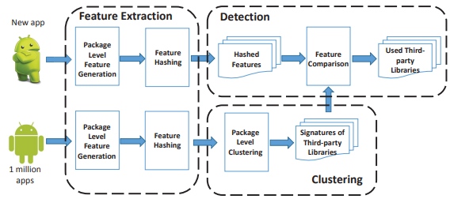
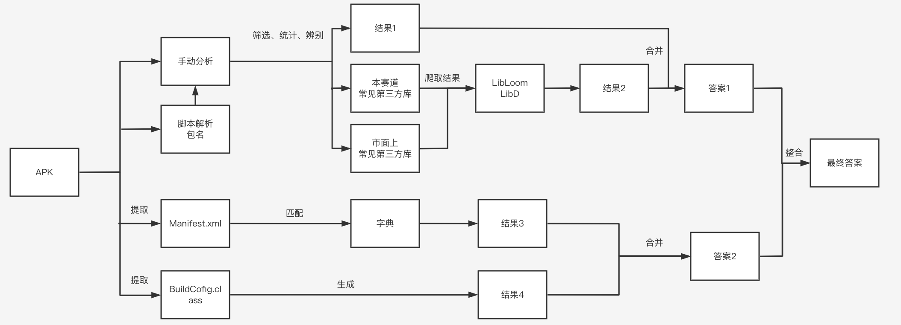
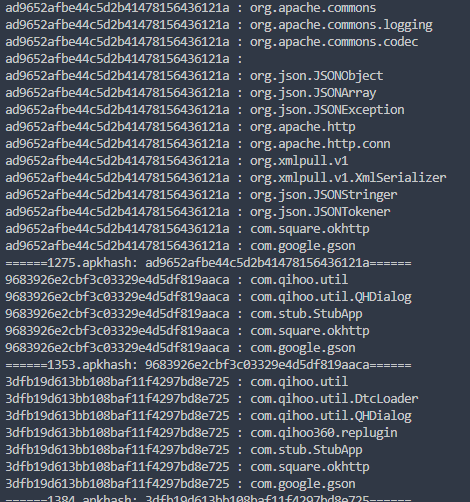

## 0x1 背景

安卓系统至2007年发布以来就受到了市场的巨大推崇，并带动了安卓APP的迅猛发展，其在Google Store中就具有超过3百万APP。为了节约APP开发时间，开发者们通过使用第三方库的形式将打包好的程序放置到开源网站中供人使用，据统计显示，超过51%的APP都使用了第三方库。

作为一把双刃剑，第三方库的使用虽然便利了APP开发，但也带来了巨大的安全隐患，任何人均可将带有恶意功能的代码上传，来达到远程控制(如发送短信、利用无障碍操纵手机)、窃取隐私(如通讯录、位置)，暗中盈利(广告隐藏)等目的，此外，第三方库中还可能存在许可证违规(如GPL License)等问题。因此，识别出安卓APP中的第三方库，有助于保障用户权益不受侵害、减少代码违规情况，保障应用市场安全稳定。


## 0x2 现有研究

现有的第三方库识别工作主要可分为两类：基于特征匹配或聚类算法

#### 1.特征匹配

特征匹配法首先需要提取常见第三方库的特征，如包结构、类依赖关系、字符串、基本块等，再将待测目标APK的特征与已提取的第三方库特征进行匹配，当二者的相似性达到阈值时认为具有该第三方库，该方法的好处在于识别较为准确，缺点是需要提前构造特征库

常见工具：LibScout、LibDx、LibLoom


#### 2.聚类算法

聚类算法则需要大量搜集第三方库，并使用机器学习算法进行分析，训练完成后，方法能够识别输入APK内含有的第三方库，该方法的好处在于不需要定义第三方库特征，但需要大量APK样本进行训练，同时测试结果具有不可解释性

常见工具：LibRadar、LibD



#### 3.遗留问题

加壳：学术界的研究将脱壳与第三方库识别作为两个不同问题进行讨论，因此现有工具均没有考虑APP加壳问题

抗混淆：主要分为两类混淆，即包级别(package level)的混淆(如package flatten、repackage等)以及代码级别(code level)的混淆(如code rename、dead code remove)。结合本队伍的前期测试经验，发现现有工具针对代码级别的混淆有一定的抵抗力，但很难抗包级别的混淆


## 0x3 赛题场景

本次题目要求识别2000个APP中的组成成分，并以如下形式提交结果：


结合实际分析，本队伍发现以下难点：

#### 1.运行环境

主办方给的运行环境和本队伍日常使用的环境算力差距较大，减缓了结果的生成时间。同时，通过特征匹配工具进行识别需要大量搜集第三方库生成特征来提高识别精准度，而过多的特征库可能导致工具在会因算力不足而中断

#### 2.信息搜集

搜集的第三方库特征越多，工具进行匹配的效果越好，但如何搜集到更多的第三方库存在困难

#### 3.加壳混淆

现有工具无法应对加壳，面对混淆时效果差，而赛题中的APP超过半数都进行加壳或混淆，降低了现有工具本就不完全可靠结果的可信度，因此已有工具只能作为参考，需要提出新的解题方法


## 0x4 解题思路

综合上述分析，产生了如下思路：

[1]抽取APK进行手动分析，与脚本解析的包名筛选、合并后，得到初步第三方库结果，同时观察其中其来源、类型、命名规则，结合论文总结的最受欢迎第三方库作为搜集对象，针对maven库进行爬取

[2]使用现有工具LibD、LibLoom，依据上述特征库对目标APK进行解析，得到的结果与手动分析结果构成第一部分答案

[3]之后，通过解析APK中BuildConfig类得到部分第三方库的包名、版本，提取Manifest文件匹配疑似第三方库格式的可能结果，并结合自己构造的字典文件得到该第三方库的准确名称，之后，将二者合并作为第二部分答案

[4]最后，合并两部分答案得到最终结果

整体过程如下图：



#### 1.手动分析

通过手动分析可以清晰看到APK中的第三方库，如com.umeng是友盟sdk、com.bytedance是字节跳动sdk等，手动分析的准确度高，缺点是速度慢


因此，对于绝大多数手动分析的APK，我们只对其中存在的常见库如okhttp、gson、okio、retrofit2、sqlcipher进行筛选，其他第三方库则在后续进行补充。此外，我们还列举出了目标APK中的包名帮助提升分析速度。以上分析的结果即为结果1



之后，根据此阶段分析的结果与之前在相关领域的积累，我们构造了用于匹配sdk_path和sdk_name的字典


#### 2.第三方库爬取

根据手工分析的结果与LibScout等论文的统计，我们使用python爬虫对Maven内的对应库进行了爬取，如高德地图SDK


但对于部分需要实名认证的API(如百度地图)或没有在maven等市场中出现的库(如万能wifi)，我们没能进行爬取


最终，本过程搜集了10281个版本的第三方库，加上之前积累的第三方库共记15044个


#### 3.工具分析

结合上述搜集的第三方库，我们使用现有工具进行初步分析

##### LibD

本次样本的测试结果显示LibD很难应对混淆情况，未混淆时结果如下：


而混淆时基本得不到结果：


##### Libloom

Libloomd的结果主要是出现了多版本检出的问题，而且检出库与实际存在的目标库匹配度较低


根据上述工具输出，我们得到了结果2，但由于加壳、混淆情况的出现，使得其检测效果较差，只做补充结果

#### 4.Manifest分析

由于加壳不影响Manifest文件，因此我们从该文件入手识别部分第三方库，如下图Manifest文件中能发现神奇浏览器(com.z28j)这一第三方库


Manifest分析过程具有四个步骤：

[1]反汇编获取Manifest文件并保存

```python
def get_xml(filepath, outpath):
    filenames = os.listdir(filepath)
    for filename in filenames:
        try:
            apk_file = APK(filepath + filename)
        except:
            continue
        filename = get_md5(filepath + filename)
        manifest = apk_file.get_android_manifest_axml().get_xml()
        with open(outpath + filename + ".xml", "wb") as f:
            f.write(manifest)
        # print(manifest)
```

[2]解析xml文件获取其中的包名

```python
for child in root:
  					# 从application中抽取activity
            if child.tag == "application":
                for subchild in child:
                    activityName = subchild.attrib[keyName]
                    if "." not in activityName:
                        continue
                    Group3 = ""
                    Group4 = ""
                    if getGroupName(activityName) != None:
                        Group3, Group4 = getGroupName(activityName)
                    if Group3 != "" and Group3 not in Group3s:
                        Group3s.append(Group3)
                    if Group4 != "" and Group4 not in Group4s:
                        Group4s.append(Group4)
```

[3]通过包名得到第三方库初步结果


[4]将包名与字典匹配获取该部分最终结果(结果3)，修正了sdk_name


#### 5.BuildConfig分析

BuildConfig是gradle build生成的配置文件，可以很明显的识别第三方库及版本，如下是友盟SDK的BuildConfig


BuildConfig分析过程具有三个步骤：

[1]反汇编APK文件，使用androguardAPI获取BuildConfig类与内容

[2]筛选类内的APPLICATION_ID和VERSION_NAME并保存，上述过程的部分代码如下

```python
#分析获取buildconfig
def anaylis(path):
Load our example APK
    all_libs = {}
    apks_num = len(os.listdir(path))
    count = 0
    for file in os.listdir(path):
        filepath = path + file
        # Load our example APK
        try:
            a = APK(filepath)
            # Create DalvikVMFormat Object
            d = DalvikVMFormat(a)
            # Create Analysis Object
            dx = Analysis(d)
        except:
            continue
        # Load the decompiler
        # Make sure that the jadx executable is found in $PATH
        # or use the argument jadx="/path/to/jadx" to point to the executable
        decompiler = DecompilerDAD(d, dx)
        # propagate decompiler and analysis back to DalvikVMFormat
        d.set_decompiler(decompiler)
        d.set_vmanalysis(dx)
        libs = []
        try:
            classes = d.get_classes()
        except:
            continue
        for c in classes:# 判断classname是不是包含buildconfig
            if "buildconfig" in c.name.lower():
                print(c.name)
                lib = {}
                lib["sdk_name"] = ""
                lib["sdk_path"] = ""
                lib["sdk_key"] = ""
                lib["sdk_version"] = ""
                lib["sdk_type"] = "code"
                lib["sdk_id"] = ""
                fileds = c.get_fields()
                for filed in fileds:
                    # 获取pkgname 和 version
                    if filed.get_name() == "APPLICATION_ID":
                        pkgname = filed.get_init_value().get_value()
                        lib["sdk_name"] = pkgname
                        lib["sdk_path"] = pkgname.replace(".", "/")
                    if filed.get_name() == "VERSION_NAME":
                        version = filed.get_init_value().get_value()
                        lib["sdk_version"] = version
                if lib["sdk_path"] != "":
                    libs.append(lib)
        if libs != []:
            print(libs)
        count += 1
        print("============Now===" + str(count) + "/" + str(apks_num) + "======ratio is==" + str(count * 100 / apks_num) + "%===================")
        fileHash = get_md5(filepath)
        all_libs[fileHash] = libs
    with open("buildConfig.json", "w", encoding='utf-8') as f:
        f.write(json.dumps(all_libs, ensure_ascii=False, indent=4, separators=(',',':')))
    print(all_libs)
```

识别结果如下：


[3]将包名与字典匹配获取该部分最终结果(结果4)，如下：


#### 6.合并结果

将上述结果去重、审核，得到最终提交的答案


## 0x5 总结与展望

APP组成成分分析并不是一个很新颖的话题，在此之前已经自动分析过F-droid中的开源APK，但面对各种商用APK分析时对我们依旧是挑战。相对于使用开源工具，本次挑战赛给予我们机会第一次将自己的思想用于分析之中，为今后的研究奠定了基础。

对于今后，希望进一步结合分析经验，将工业界与学术界方法灵活结合，做出真正意义上能用、好用、有更高技术价值的工具。